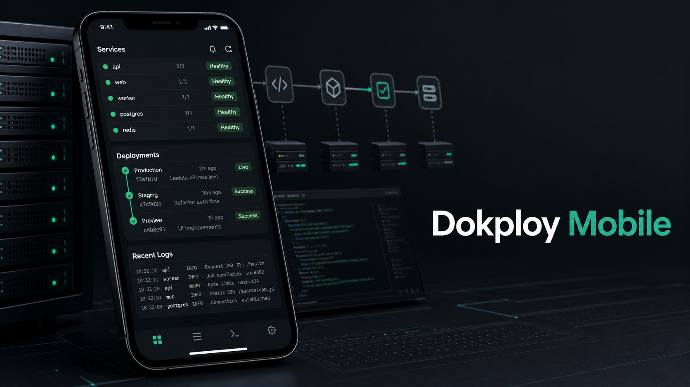

# Dokploy Mobile

An unofficial native mobile command surface for checking Dokploy projects,
deployments, logs, requests, notifications, and web server operations from your
phone.


Dokploy Mobile is built for the moments when you are away from your desk but
still need to understand what is happening on a Dokploy server. It gives
operators a focused mobile view of projects, services, deployments, request
traffic, logs, notifications, and owner-only server tools without opening the
full web dashboard.

## Why It Exists

Production checks rarely wait for a laptop. A deployment can fail while you are
in transit, a service can stop during a call, or a burst of 5xx responses can
start before you are back at your desk.

This app is meant to make those first few minutes less blind. Open it, check the
health snapshot, jump into the service or deployment that needs attention, and
inspect the logs or request samples that explain what changed.

## What You Can Do

- Monitor Dokploy projects, environments, applications, compose services, and
  databases from a native mobile interface.
- See a home health overview with service counts, request health, recent
  deployments, and priority items that need attention.
- Inspect deployment history and open live deployment logs when a release needs
  a closer look.
- Read container logs for supported services without switching to the web
  dashboard.
- Review request logs with search, date, and status filters for quick traffic
  triage.
- Manage service domains and environment values where the connected Dokploy API
  supports it.
- Configure owner-gated notification targets and receive mobile push
  notification support through Firebase Messaging.
- Use owner-only web server tools, including server domain and backup
  management.
- Save and switch between organizations on the same Dokploy server.

Server URLs are stored locally, and personal access tokens are kept in secure
device storage. The app uses MMKV for fast local state and Expo SecureStore for
sensitive tokens.

## Current Status

Dokploy Mobile is open source and under active development. The app is designed
primarily for iOS and Android Devices.

Because the project uses native modules such as Firebase Messaging, full native
behavior should be tested in a development build or compiled app. Expo Go is not the target runtime for the
complete Dokploy Mobile feature set.

## Getting Started

You will need:

- Node.js
- npm, yarn, pnpm, or bun
- A reachable Dokploy server
- A Dokploy personal access token
- iOS Simulator, Android Emulator, or a physical device for native testing

Clone the repository and install dependencies:

```bash
git clone git@github.com:AbdullahNoori/dokploy-mobile.git
cd dokploy-mobile
npm install
```

Start the Expo development server:

```bash
npm run dev
```

Useful scripts:

```bash
npm run ios
npm run android
npm run web
```

For a native development build, use Expo's native run commands:

```bash
npx expo run:ios
npx expo run:android
```

When the app opens, enter your Dokploy server URL and personal access token. The
server URL is normalized to the Dokploy API path automatically.

## Contributing

Issues and pull requests are welcome. The project is still evolving, so focused
changes are easiest to review and merge.

Before opening a PR:

- Keep the change scoped to one behavior or screen.
- Follow the design system in [design.md](design.md).
- Reuse the shared UI components and existing data-fetching patterns.
- Run the relevant TypeScript, lint, or runtime checks for the area you touched.

## License

Dokploy Mobile is released under the [MIT License](LICENSE).

Built and maintained by [Abdullah Noori](https://github.com/AbdullahNoori).

Repository: [github.com/AbdullahNoori/dokploy-mobile](https://github.com/AbdullahNoori/dokploy-mobile)
